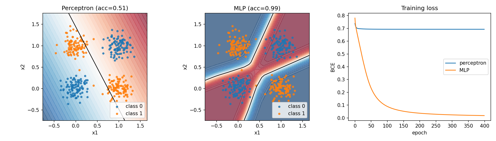
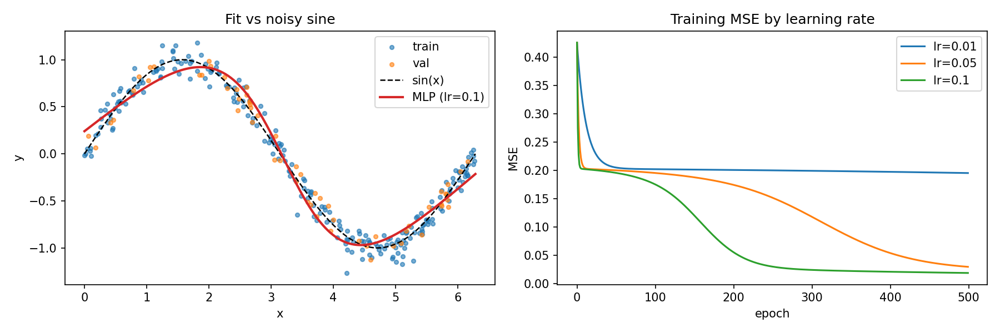
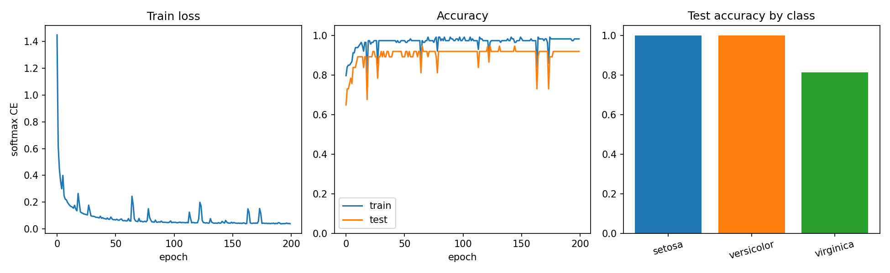

# Neural Networks From Scratch

A small neural network library written in NumPy, used across three experiments: XOR classification, synthetic regression, and Iris multi-class classification.

I deliberately avoided PyTorch and TensorFlow. There is no autograd here - every forward pass, loss, and gradient update is implemented by hand. The point of the project was to make sure I actually understood those pieces, not just how to call a framework API.

## Results

| Experiment | Result |
|---|---|
| XOR (perceptron vs MLP) | Perceptron 50% accuracy (chance level); MLP 99% |
| Regression (`sin(x)` + noise) | Best learning rate 0.1; validation MSE ≈ 0.016 |
| Iris (3-class classification) | Train 98% / test 92% (virginica hardest at 81%) |

## Layout

```
core/                       activations, dense layers, losses, MLP, helpers
experiments/xor/            perceptron vs MLP on noisy XOR
experiments/regression/     fit a noisy sine curve; compare learning rates
experiments/iris/           preprocess Iris, train with softmax + mini-batches
```

## Setup

Requires Python 3.10+.

```bash
python -m venv .venv
source .venv/bin/activate
pip install -r requirements.txt
```

Run commands from the repository root so the `core` and `experiments` packages import correctly.

---

## 1. XOR

```bash
python -m experiments.xor.xor_train
```

XOR is a useful first test because the labels are simple, but the classes are not linearly separable. I generated four noisy clusters around the XOR corners and trained two models on the same data with binary cross-entropy:

- a perceptron: one dense layer and a sigmoid output
- a small MLP: one ReLU hidden layer and a sigmoid output

Both models use the same training loop in `core/`. The only real difference is the architecture.



The left plot is the perceptron. It can only draw a single straight decision boundary, so it ends up near 50% accuracy - there is no line that puts both blue clusters on one side and both orange clusters on the other.

The middle plot is the MLP. With a hidden layer and a non-linear activation, the decision surface can bend, and accuracy reaches about 99%.

The loss curves on the right match that picture. The perceptron stalls near `log(2) ≈ 0.69`, which is what you expect from chance-level predictions on balanced binary labels. The MLP loss falls towards zero.

That is the main idea this experiment is meant to show: non-linearity in the model is not optional for problems like this, and you can see the failure mode directly in the boundary and the loss.

---

## 2. Regression

```bash
python -m experiments.regression.regression_train
```

The second experiment moves from classification to regression. The target is `y = sin(x) + noise`. The network uses tanh hidden layers, a linear output, and mean squared error. The backprop code is the same as before; the loss and output activation change to match the task.



On the left, the MLP recovers the underlying sine wave from the noisy train and validation points. It follows the shape of `sin(x)` without chasing every noisy sample, which is what you want from a fit like this.

On the right, the same architecture is trained with three learning rates. At 0.01, training is slow and stalls at a higher MSE. At 0.05 it eventually improves. At 0.1 it converges fastest in this sweep and reaches the lowest validation MSE (about 0.016).

So this section is not only "can the network approximate a curve?" It is also a check that the training dynamics behave sensibly when you change the step size.

---

## 3. Iris

```bash
python -m experiments.iris.iris_train
```

The last experiment uses the Iris dataset: 150 samples, 4 features, 3 classes. Features are normalised using statistics fitted on the training split only, then the model is trained with mini-batch SGD. The network outputs logits; softmax and categorical cross-entropy are combined in the loss.



Training loss drops quickly and then levels off. Train accuracy reaches about 98%, and test accuracy about 92%. That gap is reasonable for a dataset this size.

Broken down by class, setosa and versicolor are essentially perfect on the held-out set. Virginica is harder (around 81%), which fits the usual pattern that virginica and versicolor overlap more in feature space.

This experiment is the practical check that the same `core/` code still works once you add real data loading, normalisation, batching, and a multi-class output.

---

## What I was aiming to demonstrate

Across the three experiments, the same library supports:

1. a clear failure case for a linear model, and a working non-linear alternative
2. backprop for both classification and regression, with the matching activations and losses
3. a full train and evaluate loop on real data, including preprocessing and mini-batches

Iris itself is not a difficult benchmark. The useful part is that the modules under `core/` are reusable, and the plots are evidence that the gradients are doing the right thing.

## Possible next steps

- Add momentum or Adam alongside plain SGD
- Try a deeper MLP and compare the XOR / regression fits
- Add dropout or L2 regularisation and measure the effect on the Iris train/test gap
- Compare against `sklearn.neural_network.MLPClassifier` as a sanity check

## License

MIT
